# DLZS-AM

**An FPGA-optimized differential log-domain approximate multiplier — design, characterization, AXI4-Lite integration,
and attention top-k ranking study. Error compensation is planned.**

B.Tech ECE major project, NIT Andhra Pradesh.

**Updated: 14 September 2026.** Standalone RTL characterization, AXI simulation,
PYNQ bitstream generation, and the fixed-corpus attention ranking study are
complete. Physical-board regression and error compensation remain pending.

Jump to [hardware results](#7-implementation-results),
[PYNQ integration](#8-pynq-z2-integration-checkpoint),
[attention results](#9-attention-top-k-study--completed-fixed-corpus-experiment),
[run instructions](#12-running-it), or [roadmap](#14-roadmap).

---

## Headline result

On a LUT-only Zynq-7020 (xc7z020clg400-1), post-route, 16×16 → 32 signed:

| Design | Mean rel. error | Slice LUTs | Fmax (MHz) | Energy / multiply* |
|---|---|---|---|---|
| Exact multiplier (LUT-only) | 0 | 265 | 104.3 | 49.55 pJ |
| **DLZS, optimized (`dlzs_opt`)** | 16.8 % | **145** (−45 %) | **121.5** (+16.5 %) | **21.20 pJ** |

\* Vivado activity-driven estimate, 50 % input toggle rate, Medium confidence;
see §7. These are estimates, not board measurements.

`dlzs_opt` is the only approximate design in the comparison that beats the
exact multiplier on **both** area and speed, and it also has the lowest
estimated energy per multiply among the LUT-only designs with refined power
reports. It is bit-for-bit identical to
the original DLZS design, so it has exactly the same error; all of the gain
comes from the architecture (§5). It is also the **least accurate** design in
the comparison, and that trade is the whole story — see §7.

---

## 1. What this is

A multiplier is one of the most expensive things you can put on an FPGA fabric.
An *approximate* multiplier trades a bounded amount of numerical error for a
reduction in area and delay — a good trade whenever the consumer of the result
only needs a ranking or a threshold decision, not an exact product.

This project implements and characterizes **DLZS** (differential leading-zero
summation), a scheme from the SOFA accelerator paper (Wang et al., MICRO 2024).
DLZS is asymmetric: it snaps **one** operand to a power of two using its
leading-one position, and **shifts** the other operand by that amount. The
multiply collapses into a leading-one detector and a shifter.

    A × B  ≈  2^round(log₂ A) × B  =  B << round(log₂ A)

SOFA describes DLZS as a component inside a larger accelerator, and its notation
is ambiguous about which way the snap rounds. This project studies its standalone FPGA cost and ranking error under a
controlled comparison; it does not establish a literature-wide priority claim.

### What is and is not claimed

Log-domain multiplication is **Mitchell (1962)** and is **not** claimed as novel.
The claims are narrower:

- a standalone FPGA implementation and error characterization of the
  asymmetric log scheme, against DRUM, Mitchell and an exact multiplier under
  identical LUT-only constraints;
- an FPGA architecture for signed DLZS that removes the sign-handling cost
  (§5), and an equally optimized DRUM so the comparison is effort-matched (§6);
- an MBM-style error compensation, evaluated on an accuracy-vs-LUTs Pareto
  front (planned, Week 12–13).

A negative result on the compensation tier is acceptable provided it is
characterized honestly.

---

## 2. The four snap interpretations

Because SOFA's notation is ambiguous, all four readings are implemented and
measured. Operand **A** is always snapped; operand **B** is shifted.

| Mode | A snaps to | Round-up test | Relative error of A |
|------|-----------|---------------|---------------------|
| `dlzs_floor` | 2^⌊log₂A⌋ | never | (−0.5, 0] — always under |
| `dlzs_ceil` | 2^⌈log₂A⌉ | whenever A is not a power of two | [0, +1.0) — always over |
| `dlzs_nearest_linear` | nearer power, **linear** midpoint 1.5·2^k | bit (k−1) of A is set | [−0.25, +0.333] |
| `dlzs_nearest_log` | nearer power, **log** midpoint √2·2^k | A² ≥ 2^(2k+1) | [−0.293, +0.414] |

**Chosen specification: `dlzs_nearest_linear`, ties round up.** It wins the
DLZS family on every error metric (§4) and is the cheapest snap in hardware:
the round-up decision is a single bit tap. The tie-break is a specification,
and the RTL matches it bit-for-bit.

---

## 3. Baselines

**Exact.** `$signed(a) * $signed(b)`, mapped to LUTs (`-max_dsp 0`). Vivado
folds the sign into the partial products, so it pays no separate sign cost.

<details>
<summary>Exact multiplier — Yosys top schematic</summary>

[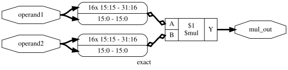](docs/images/schematics/exact.svg)

*Exact 16×16 signed multiplication. The same RTL serves the LUT-only and DSP-mapped implementations; this diagram shows arithmetic before technology mapping.*

</details>

**DRUM(k)** (Hashemi, Bahar, Reda, ICCAD 2015). Truncate both operands to their
k most significant bits from the leading one, force the lowest kept bit to 1
(unbiased rounding), multiply exactly in a k×k core, shift back up. Unbiased
by construction. Two versions are compared:

- **as published** — the authors' unsigned cores (vendored, unmodified logic)
  inside a sign-magnitude shell;
- **FPGA-optimized** — our own implementation, bit-exact with the published
  cores (§6).

**Mitchell (1962).** Both operands to the log domain, log₂(1+m) ≈ m. Always
underestimates; worst case −11.1 %, at mantissas of exactly 0.5 (e.g.
192 × 192 at 8 bits). RTL, a signed wrapper, a cocotb bench and post-route
reports are now included.

<details>
<summary>Mitchell multiplier — Yosys top schematic</summary>

[](docs/images/schematics/mitchell_mult_top.svg)

*Signed Mitchell top: input magnitudes, the unsigned logarithmic core, and output sign restoration.*

</details>

---

## 4. Accuracy

Golden model, 16-bit **unsigned** operands, the sweep set from `src/sweep.py`:
200,000 uniform random pairs (seed 20260828) plus 3,600 corner pairs. Signed
operands give the same figures to within 0.03 %. Metrics are defined in
`src/metrics.py`.

| Design | MRED | Bias | Max RED |
|---|---|---|---|
| exact | 0 | 0 | 0 |
| DRUM k=8 | 0.37 % | +0.02 % | 1.57 % |
| DRUM k=7 | 0.74 % | +0.03 % | 3.15 % |
| DRUM k=6 | 1.49 % | +0.08 % | 6.35 % |
| DRUM k=5 | 2.99 % | +0.21 % | 12.89 % |
| Mitchell | 3.81 % | −3.81 % | 11.11 % |
| DRUM k=4 | 6.00 % | +0.71 % | 26.56 % |
| DRUM k=3 | 12.14 % | +2.43 % | 56.25 % |
| **DLZS nearest-linear** | **16.84 %** | **−1.89 %** | **33.33 %** |

The Mitchell row was regenerated from the committed golden model using the
same 200,000 random pairs and 3,600 corners (seed 20260828).

Cross-check: the DRUM paper reports 1.47 % mean relative error for DRUM6; the
golden model gives 1.468 % on a pure random sample (the 1.49 % above includes
the corner set, which skews toward boundary cases).

### 8-bit exhaustive — all 65,536 ordered pairs

```
design                   MRED   maxRED      bias      NMED      maxAED err_rate
-------------------------------------------------------------------------------
dlzs_floor            0.29855  0.49804  -0.29855  0.082682       32385  0.96107
dlzs_ceil             0.37153  0.98450  +0.37153  0.082682       32385  0.96107
dlzs_nearest_linear   0.16918  0.33333  -0.00964  0.041828       16320  0.96107
dlzs_nearest_log      0.17364  0.40659  +0.03890  0.042961       18870  0.96107
mitchell              0.03788  0.11111  -0.03788  0.009326        4096  0.93092
drum4                 0.05887  0.26562  +0.01596  0.014238        7425  0.97717
drum6                 0.01301  0.06348  +0.00571  0.003581        2000  0.85431
```

DLZS is not an accuracy play: DRUM6 is about 11× more accurate, and even DRUM3
has a lower mean error (though a worse worst case). The case for DLZS is
hardware cost, and whether its error is tolerable for top-k attention ranking
— a consistent scaling bias does not change a ranking, the spread of the error
does. The completed fixed-corpus study is reported in §9.

---

## 5. The optimized DLZS architecture (`dlzs_opt`)

### Where the original design spent its time

The first DLZS design wrapped the unsigned core in a full sign-magnitude shell:
negate A, negate B, run the core, negate the 32-bit result. Its critical path
was one long series chain:

    abs(A) → LZC → 16:1 mux for the round bit → 5-bit add → 5-stage shifter → 32-bit negate

The 32-bit output negate alone is 8 CARRY4s at the end of the path.

**Original signed DLZC — Yosys**

[](docs/images/schematics/dlzc_mult_top.svg)

*The original dlzc_mult_top sign-magnitude implementation: input magnitude conversion, the unsigned core, and output sign restoration.*

**Original signed DLZC — Vivado**

[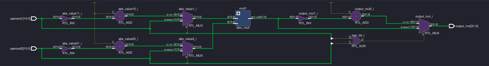](docs/images/vivado/elaborated/dlzc_mult_top.png)

*Vivado elaboration of the same module, showing both input negation branches and the output negation branch.*

### The rule behind every change

> The sign can be folded, for free, into any part of the datapath that is
> **linear**. It must be removed before any part that works on the
> **magnitude**.

In DLZS only A goes through a magnitude operation (the leading-one snap). B is
only shifted, and a left shift is linear in two's complement. So B never needs
to leave two's complement.

### The four changes

1. **Keep B signed.** If A is negative, negate B *before* the shift (17 bits,
   so −(−32768) fits), since −(B·2^e) = (−B)·2^e. The 32-bit output negate is
   gone. This B branch depends only on raw input bits, so it runs in parallel
   with A's path and is off the critical path.
2. **Merge the round-up into the leading-one detector.** Build

       V = M | ((M & (M >> 1)) << 2)          M = |A|

   Bit i of V is M[i] OR (M[i−1] AND M[i−2]). The leading-one position of V
   *is* the snapped exponent, ties rounding up. A "11" pair at the top of M
   plants a 1 one place above the leading one; otherwise every pair plants at
   or below it. Verified against the reference snap for all 65,535 non-zero
   16-bit values. This removes the 16:1 round-bit mux and the adder.
3. **Four-bit exponent, two-level shifter.** For signed inputs the snapped
   exponent never exceeds 15 (checked over every magnitude), so it is 4 bits.
   A LUT6 is a 4:1 mux, so the shift is two LUT levels: `e[3:2]` first (it is
   ready earliest), then `e[1:0]`.
4. **Zero guard moved into the B branch.** A = 0 forces the prepared B to 0,
   instead of adding a LUT level at the output.

The critical path is now:

    abs(A) → V logic merged into the LZC → two shifter levels

Post-route this is **8 logic levels** against 15 for the original design.

**Optimized signed DLZC — Yosys**

[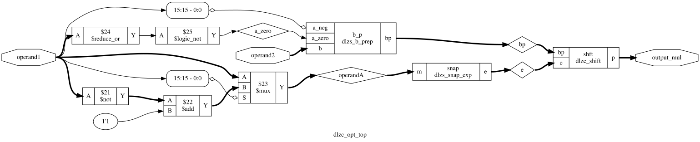](docs/images/schematics/dlzs_opt_core.svg)

*The optimized dlzc_opt_top datapath: A supplies the snapped exponent and the prepared signed B operand feeds the shifter, removing the 32-bit output negate.*

**Optimized signed DLZC — Vivado**

[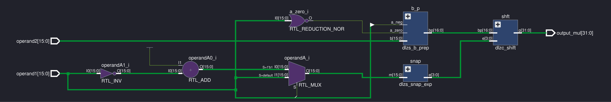](docs/images/vivado/elaborated/dlzc_opt_top.png)

*Vivado elaboration shows the snap, B-preparation and shift blocks, with the A-magnitude logic and independent zero detection.*

These are RTL schematics, not post-route physical views. Yosys and Vivado
arrange the same design differently. Click an image to inspect it at full
size; the measured logic-level counts come from the timing reports in §7.

### Output range

The largest output magnitude is 2^30, the same as the exact multiplier. DLZS
can produce −2^30 (A = 32767 rounds up to 2^15, B = −32768), one step below
exact's most negative product −2^30 + 2^15. Both fit the same 32-bit port.

### Verification

`tb/opt` — 8 tests, ~950,000 vectors, all passing. The snap block is checked
exhaustively over every legal magnitude, the B branch exhaustively over all
65,536 B in every flag combination, the shifter over every shift against the
extremes, and the assembled design over all 65,536 A × 10 B against **both**
the golden model and the original verified `dlzc_mult_top`. Re-injecting the
two bugs found during development (raw A into the snap, a missing +1 in the
negate) fails 5 of the 8 tests.

---

## 6. DRUM: audit and FPGA-optimized implementation

### Audit of the published code (scale-lab/DRUM @ 2c7ef20)

| Check | Result |
|---|---|
| Vendored `DRUM6_16_u.v` vs upstream | identical logic (header comment added) |
| Vendored `DRUM4_16_u.v` vs upstream | identical logic; module names suffixed `4` so both cores compile together, and the upstream typo `ux_16_3` fixed — upstream does not elaborate as released |
| Both cores vs upstream's parameterized `dsmk_mn` | 0 mismatches in 1,148,576 vectors each (k=4 and k=6) |
| Upstream `DRUM6_16_s.v` signed wrapper | **broken**: product sign computed with AND instead of XOR |
| Upstream `DRUMk_M_N_s.v` signed wrapper | **broken**: one's complement (`~a`) instead of two's complement, off by one on every negative path |
| Our `drum_signed_top` | same shell structure as upstream `DRUM6_16_s`, with XOR |
| Golden model vs paper | DRUM6 mean relative error 1.468 % vs the paper's 1.47 % |

### Why DRUM cannot use the DLZS sign trick

DRUM truncates **both** operands, and truncation works on the magnitude: on a
negative two's-complement number the "leading one" is always bit 15, and
dropping low bits rounds toward −∞ instead of toward zero. So both operands
need |X|. This is a property of the algorithm, not an effort gap.

### The FPGA-optimized DRUM (`drum_opt`, K = 3..8)

The key idea is **sign-carrying operands with no negation**. After truncation,
each operand is a small K-bit number, and each of its two forms carries the
sign for free:

- **exact case** (|X| < 2^K): X itself fits in K+1 bits, so its own low bits
  are the signed value;
- **truncated case**: DRUM's operand is `{1, m, 1}` — odd — and negating an odd
  number needs no carry, so −`{1,m,1}` is `{1, 0, ~m, 1}`.

A signed (K+1)×(K+1) multiply then gives the correctly signed product, and
Vivado folds the sign into its partial products. There is no output negate and
no zero special case. The design also uses the same structured `lzc_16` as
DLZS, computes the exact-case flag in parallel with it, and computes the shift
amount off the critical path.

Verification: `tb/drum_opt` — all six K elaborated side by side; the operand
block exhaustively over all 65,536 inputs for every K, the top over all
65,536 A × 10 B for every K against the golden model **and**, for K = 4 and 6,
against the published DRUM cores. All passing.

<details>
<summary>DRUM baselines — one Yosys top schematic per configuration</summary>

**Published DRUM, K=4 — signed top**

[](docs/images/schematics/drum_signed_k4.svg)

*Signed wrapper around the vendored DRUM4 core.*

**Published DRUM, K=6 — signed top**

[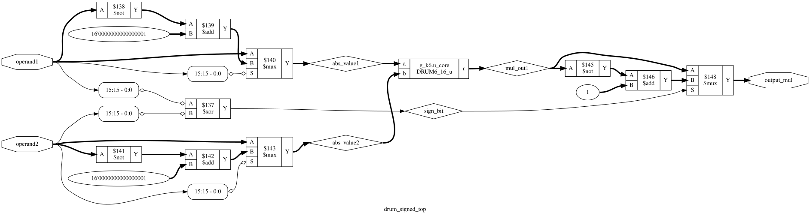](docs/images/schematics/drum_signed_k6.svg)

*Signed wrapper around the vendored DRUM6 core.*

**Optimized DRUM, K=3 — signed top**

[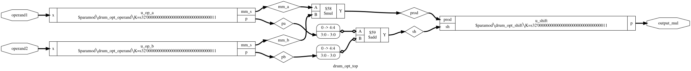](docs/images/schematics/drum_opt_k3.svg)

*Optimized DRUM with K=3: two sign-carrying operand blocks, a signed 4×4 multiply, and the final shift.*

**Optimized DRUM, K=4 — signed top**

[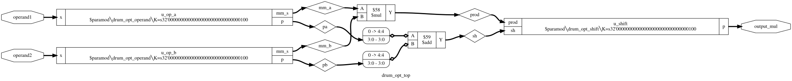](docs/images/schematics/drum_opt_k4.svg)

*Optimized DRUM with K=4: two sign-carrying operand blocks, a signed 5×5 multiply, and the final shift.*

**Optimized DRUM, K=5 — signed top**

[](docs/images/schematics/drum_opt_k5.svg)

*Optimized DRUM with K=5: two sign-carrying operand blocks, a signed 6×6 multiply, and the final shift.*

**Optimized DRUM, K=6 — signed top**

[](docs/images/schematics/drum_opt_k6.svg)

*Optimized DRUM with K=6: two sign-carrying operand blocks, a signed 7×7 multiply, and the final shift.*

**Optimized DRUM, K=7 — signed top**

[](docs/images/schematics/drum_opt_k7.svg)

*Optimized DRUM with K=7: two sign-carrying operand blocks, a signed 8×8 multiply, and the final shift.*

**Optimized DRUM, K=8 — signed top**

[](docs/images/schematics/drum_opt_k8.svg)

*Optimized DRUM with K=8: two sign-carrying operand blocks, a signed 9×9 multiply, and the final shift.*

</details>

---

## 7. Implementation results

Post-route, out-of-context, LUT-only (`-max_dsp 0`, verified 0 DSPs on every
row), xc7z020clg400-1, 10 ns clock constraint. Every design sits in the same
harness: two 16-bit input registers, the multiplier, one 32-bit output
register. Fmax = 1000 / (10 − WNS).

### All designs

| Design | Slice LUTs | LUT cells | WNS (ns) | Fmax (MHz) | Logic levels | Route share of path |
|---|---|---|---|---|---|---|
| `exact_lut` | 265 | 357 | +0.411 | 104.29 | 15 | 53 % |
| `dlzs_signed` (original) | 213 | 220 | −0.409 | 96.07 | 15 | 63 % |
| **`dlzs_opt`** | **145** | **169** | **+1.770** | **121.51** | **8** | 64 % |
| `drum4_signed` (published) | 259 | 262 | −3.056 | 76.59 | 22 | 60 % |
| `drum6_signed` (published) | 364 | 365 | −6.078 | 62.20 | 25 | 62 % |
| `drum_opt3` | 233 | 236 | −1.502 | 86.94 | 16 | 63 % |
| `drum_opt4` | 273 | 278 | −3.051 | 76.62 | 17 | 66 % |
| `drum_opt5` | 308 | 313 | −2.879 | 77.65 | 18 | 61 % |
| `drum_opt6` | 318 | 327 | −3.864 | 72.13 | 20 | 64 % |
| `drum_opt7` | 346 | 366 | −4.030 | 71.28 | 19 | 64 % |
| `drum_opt8` | 403 | 408 | −4.424 | 69.33 | 21 | 63 % |
| `mitchell` | 464 | 496 | −5.696 | 63.71 | 26 | 56 % |

`exact_lut` is the exact multiplier built **without DSP blocks**:
`$signed(a) * $signed(b)` under `-max_dsp 0`, with the DSP count parsed from
the utilization report and confirmed 0 after both synthesis and routing. It is
the fair reference for LUT-only approximate designs. The DSP-mapped exact result is a separate "what the FPGA gives you for free"
reference and is deliberately not mixed into the LUT-only comparison.

| Design | Slice LUTs | Slice FFs | DSP48E1 | WNS (ns) | Fmax (MHz) | Dynamic power | Energy / multiply |
|---|---|---|---|---|---|---|---|
| `exact_dsp` | 0 | 0 | 1 | n/a | 257.47* | 1.070 mW | 10.70 pJ |

\* The reported limit is 1000 / 3.884 ns, from the DSP48E1 clock's minimum-period
check. WNS is unavailable; this is not a register-to-register Fmax result like
the LUT rows. The harness registers are absorbed into the DSP, so zero slice
FFs does not mean an unregistered design. The DSP reference also has lower
estimated energy than DLZS; the DLZS advantage is specific to LUT-only fabric.

*Slice LUTs* (from `post_route/utilization.txt`) is the physical area and the
column to quote. *LUT cells* is what `summary.txt` counts; dual-output LUT
packing makes it larger, by 92 for the exact multiplier. `drum_opt8` reports
65 flip-flops because the placer replicated one input register. `drum_opt7`
and `mitchell` report 66 slice flip-flops each; the remaining LUT-only rows
report 64.

### Head-to-head comparisons

| Comparison | Area (Slice LUTs) | Fmax | What it shows |
|---|---|---|---|
| `dlzs_opt` vs `exact_lut` | **−45.3 %** | **+16.5 %** | the headline: faster and smaller than exact |
| `dlzs_opt` vs `dlzs_signed` | −31.9 % | +26.5 % | the architectural gain alone (same arithmetic) |
| `dlzs_signed` vs `drum4_signed` | −17.8 % | +25.4 % | matched sign shells: the algorithms alone |
| `drum_opt6` vs `drum6_signed` | −12.6 % | +16.0 % | what the published DRUM6 RTL left on the table |
| `drum_opt4` vs `drum4_signed` | +5.4 % | +0.0 % | no gain at K=4 — the published design was already near its limit |
| `drum_opt3` vs `exact_lut` | −12.1 % | −16.6 % | the cheapest DRUM: smaller than exact, but slower |

### Accuracy against cost

| Design | MRED | Slice LUTs | Fmax (MHz) | Beats exact on |
|---|---|---|---|---|
| exact | 0 | 265 | 104.3 | — |
| DRUM-opt k=8 | 0.37 % | 403 | 69.3 | nothing |
| DRUM-opt k=7 | 0.74 % | 346 | 71.3 | nothing |
| DRUM-opt k=6 | 1.49 % | 318 | 72.1 | nothing |
| DRUM-opt k=5 | 2.99 % | 308 | 77.7 | nothing |
| Mitchell | 3.81 % | 464 | 63.7 | nothing |
| DRUM-opt k=4 | 6.00 % | 273 | 76.6 | nothing |
| DRUM-opt k=3 | 12.14 % | 233 | 86.9 | area only |
| **DLZS-opt** | **16.84 %** | **145** | **121.5** | **area and speed** |

Two findings follow, both specific to this setup (16-bit, LUT-only 7-series,
single-cycle):

1. **The exact LUT multiplier dominates DRUM for every K ≥ 4** — DRUM is less
   accurate, larger and slower. The 7-series carry chains make an exact
   multiplier cheap, while DRUM's two leading-one detectors, two bit-select
   muxes and a multiplier on the critical path map poorly to LUTs. This is not
   a contradiction of the DRUM paper, which evaluated an ASIC flow.
2. **DLZS-opt is the only design that beats exact on both axes.** Its cost is
   accuracy: 16.8 % mean error against 12.1 % for the cheapest DRUM. Whether
   that is acceptable is an application question. The ranking results in §9
   quantify the trade; end-to-end task accuracy remains unmeasured.

### Power

Total on-chip power is 0.105–0.113 W for every row, but about 0.103 W of that
is **device static power** — leakage of the whole Zynq-7020, identical for
every design and unrelated to the multiplier. The comparison is in **dynamic**
power, and most fairly in **energy per multiplication**:

    E (pJ) = P_dynamic (mW) × clock period (ns)

This conversion assumes one multiplication per cycle and the stated switching
activity. Designs that miss the 10 ns target cannot operate correctly at that
clock; these figures are activity-based estimates, not demonstrated energy at
a timing-closed operating frequency.

**Activity-driven figures** — committed `power_summary.txt` reports, 50 % input
toggle rate, 0.5 static probability, post-route, 10 ns clock:

| Design | Dynamic power | Energy / multiply | vs exact |
|---|---|---|---|
| `exact_lut` | 4.955 mW | 49.55 pJ | — |
| `dlzs_signed` | 4.462 mW | 44.62 pJ | −9.9 % |
| **`dlzs_opt`** | **2.120 mW** | **21.20 pJ** | **−57.2 %** |
| `drum4_signed` | 5.823 mW | 58.23 pJ | +17.5 % |
| `drum6_signed` | 8.680 mW | 86.80 pJ | +75.2 % |
| `drum_opt3` | 4.089 mW | 40.89 pJ | −17.5 % |
| `drum_opt4` | 5.351 mW | 53.51 pJ | +8.0 % |
| `drum_opt5` | 5.394 mW | 53.94 pJ | +8.9 % |
| `drum_opt6` | 7.444 mW | 74.44 pJ | +50.2 % |
| `drum_opt7` | 7.813 mW | 78.13 pJ | +57.7 % |
| `drum_opt8` | 9.826 mW | 98.26 pJ | +98.3 % |
| `mitchell` | ≈ 8 mW* | ≈ 80 pJ* | not comparable* |

Read these as **estimates, not measurements**. The refined reports use mW to
three decimals and report Medium confidence. DLZS-opt's estimated energy is
57.2 % below exact LUT under these assumptions.

\* Mitchell has only the default-activity `post_route/power.txt` report, rounded
to 1 mW. Its refined power report is not committed, so its power saving against
the activity-driven rows is left unreported. The DSP reference is above.

**Refined run — `make power`** (script `synth/power.tcl`). It reopens each
routed checkpoint and:

- applies **identical activity** to the 32 data inputs of every design: 50 %
  toggle rate and 0.5 static probability, which is what uniform random
  operands produce (each bit changes with probability ½ per cycle);
- reports in **microwatts** (`set_units -power mW`, three decimals), removing
  the 1 mW rounding;
- records dynamic, logic, signal and clock power, energy per multiply and
  Vivado's confidence level in `synth_result/<design>/power_summary.txt`.

Vivado typically rates activity propagated this way as "Medium" confidence.
"High" needs a SAIF file from simulating the routed netlist with the same
vectors; `power.tcl` is written so that swapping `set_switching_activity` for
`read_saif` is the only change.

### Caveats on these numbers

- **The two passing designs' Fmax is understated.** `exact_lut` and `dlzs_opt`
  meet the 10 ns target, and the router stops improving a path once it passes.
  A tighter-period run is needed for their true maximum; the three-way
  ordering is unlikely to change, but the margin may.
- **One placement per design.** Run-to-run variation is a few percent; the
  headline margins are larger than that, the `drum_opt4` vs `drum4_signed`
  difference is not.
- **Power is estimated** — the refined reports have Medium confidence; Mitchell
  still has only a default-activity estimate. See "Power" above.
- **`dlzs_opt` vs the DRUM rows is not shell-matched** — DRUM needs two input
  negates, DLZS one. That difference is algorithmic and is stated as such;
  `dlzs_signed` vs `drum4_signed` is the matched-shell comparison.
- **Now included:** `drum_opt5`, `drum_opt7`, the DSP-mapped exact reference
  row and Mitchell RTL, with committed post-route reports. These reports do
  not replace simulation pass logs or the remaining 8-bit characterization.

---

## 8. PYNQ-Z2 integration checkpoint

The Week 8–9 hardware integration is now built through Vivado 2025.2 for the
PYNQ-Z2 (`xc7z020clg400-1`). The packaged `dlzs_axi` IP contains the optimized
signed DLZS core behind an AXI4-Lite register interface. The wrapper accepts AXI
write address and write data independently, honors byte strobes, holds write and
read responses until the master accepts them, and snapshots operands before
capturing the combinational multiplier result on the following clock.

The software-visible register map is:

| Offset | Access | Meaning |
|---|---|---|
| `0x00` | W | CONTROL bit 0 starts an operation |
| `0x04` | R | STATUS bit 0 = busy, bit 1 = done |
| `0x08` | RW | Signed operand A, low 16 bits |
| `0x0C` | RW | Signed operand B, low 16 bits |
| `0x10` | R | Signed 32-bit result |

The block design uses the Zynq processing system, AXI SmartConnect, and a
50 MHz `FCLK_CLK0`. Address Editor assigned `dlzs_axi_0` the base address
`0x43C00000` with a 64 KiB range. Block-design validation completed
successfully. Post-implementation timing also passed: WNS `+11.036 ns`, WHS
`+0.088 ns`, and zero failing endpoints.

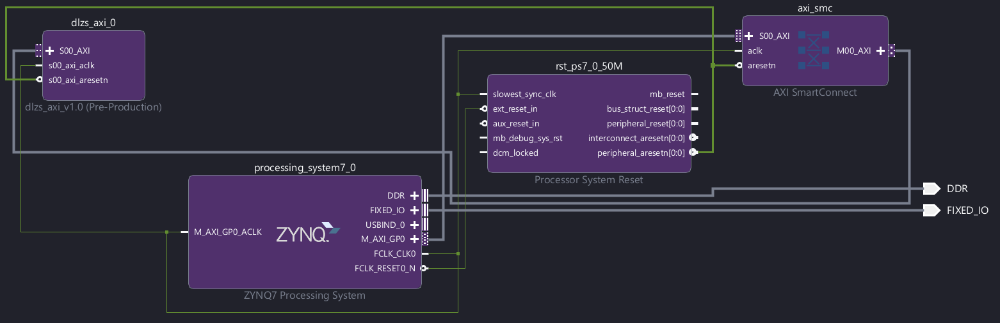

*Vivado block design showing the Zynq processing system, AXI SmartConnect,
the reset block, and the packaged `dlzs_axi_0` peripheral.*

The wrapper passed a local Vivado XSim smoke test covering 100 signed operand
pairs, split address/data arrivals, byte strobes, reset, ignored read-only and
unaligned writes, and stalled read/write responses. The generated bitstream and
hardware handoff are ready for the board run, but the required ≥10,000-vector
PYNQ regression against `src/golden_model.py` remains open until the board is
available. The completed deployment pair is now preserved at:

- [pynq_overlay/dlzs_system_wrapper.bit](pynq_overlay/dlzs_system_wrapper.bit)
- [pynq_overlay/dlzs_system_wrapper.hwh](pynq_overlay/dlzs_system_wrapper.hwh)

Both files use the same basename for PYNQ. They were preserved during cleanup;
board execution, measured power, and the hardware regression are still pending.
The FPGA overlay performs a scalar multiply through AXI4-Lite; it does not
implement the DistilBERT attention evaluation or a complete top-k accelerator.

| Integration check | Recorded result |
|---|---|
| AXI address window | `0x43C00000`–`0x43C0FFFF` (64 KiB) |
| Peripheral register decode | 32 bytes; offsets above use the low 5 address bits |
| Fabric clock | 50 MHz, shared AXI clock/reset domain |
| Block-design validation | Passed |
| Setup / hold / pulse-width slack | +11.036 / +0.088 / +9.020 ns |
| Failing timing endpoints | 0 in each category |
| XSim smoke test | User-recorded PASS: 100 signed pairs, split writes, strobes, reset, RO/unaligned writes, response stalls |
| Bitstream generation | Completed |
| Physical-board execution | Pending board access |

Timing and XSim completion above are recorded from the Vivado screenshots and
console output; the cleanup removed the generated run logs. These integration
slacks are separate from the standalone 100 MHz OOC results in §7.

CONTROL reads zero. START with byte strobe 0 set snapshots the two operands;
the following clock captures the product. DONE stays set until reset or the
next accepted start. Starts while busy are ignored. Read-only writes return
OKAY without changing storage; unaligned accesses return SLVERR. Software
should use the documented register offsets within the assigned address window.

---

## 9. Attention top-k study — completed fixed-corpus experiment

The completed run is **`20260914T070644_541555Z`**, recorded on 14 September
2026. At 10% key selection, snapping Q retains **91.90%** of the exact-int16
top-k indices; snapping K retains **89.41%**. DRUM3 retains **92.71%**, DRUM4
**96.09%**, DRUM6 **98.94%**, and Mitchell **98.25%**.

These are local ranking-preservation results on a fixed template corpus.
They are not model task accuracy, attention-output error, FPGA throughput,
or measured energy savings for an attention accelerator.

### Method and scope

| Setting | Recorded configuration |
|---|---|
| Model | `distilbert/distilbert-base-uncased` |
| Checkpoint revision | `12040accade4e8a0f71eabdb258fecc2e7e948be` |
| Corpus | 100 deterministic passages: 20 topics × 5 conditions |
| Corpus source | [attention_corpus_100.json](src/attention_corpus_100.json), reproducible with [make_attention_corpus.py](src/make_attention_corpus.py) |
| Layers / heads / head dimension | 6 / 12 / 64 (projection width 768) |
| Valid lengths / tokenizer limit | 81–105 tokens / 128; no passage truncated |
| Padding and special tokens | Padded keys and queries excluded; CLS and SEP retained |
| Q/K origin | Unmodified float32 model, eager attention; independent replacement at each layer |
| Quantizer | Symmetric signed int16, −32767…32767, zero point 0, nearest ties-to-even |
| Scales | Separate Q and K scales per passage/head, shared across valid tokens/features |
| Accumulation | int64 sum of 64 scalar products; reference score reconstruction uses float64 |
| Fractions | 5%, 10%, …, 50% of valid keys |
| Selected count | `max(1, ceil(fraction × valid_key_count))` |
| Ranking ties | Stable descending sort, preserving ascending valid-key index |
| Mean aggregation | Average query rows within each passage/layer/head, then equal weight per passage/layer/head |
| Evaluated groups / query rows | 7,200 passage/layer/head groups; 667,440 valid query rows per design/baseline/fraction |
| GPU | NVIDIA GeForce RTX 4070 Laptop GPU |
| Model batch / scoring tile | 8 passages / 16 queries × 16 keys |
| Recorded scoring-loop time | 512.65 seconds; excludes initial model load and Q/K capture |
| Peak Torch-allocated CUDA memory | 1.414 GiB; not total device usage |

For each query row, overlap is `|approx_topk ∩ reference_topk| / k`.
`quantized_exact` isolates multiplier error; `float` includes quantization
error as well. `dlzs_snap_q` sends Q to the snapped operand of DLZS;
`dlzs_snap_k` sends K there. The same RTL core implements both assignments.

Multiplying a row by a common positive scale, including `1/sqrt(64)`, preserves
its ordering. The per-passage/head Q/K scales satisfy this condition. Errors
in individual products can change the ordering after accumulation.

### Validation evidence

| Check | Result |
|---|---|
| Float attention reconstructed from captured Q/K | Passed across all 6 layers and 13 model batches per layer |
| Maximum reconstructed probability difference | 0 in the saved checks |
| Maximum valid-row probability-sum error | 3.5762787e−7 (threshold 1e−5) |
| Maximum padded-key probability | 0 (threshold 1e−7) |
| Vectorized multiplier kernels vs scalar golden model | Reported PASS on 4,096 signed pairs for each of 6 approximate designs |
| Exact int64 score matrices vs integer matrix multiplication | Checked for equality in each layer |
| Clipped Q/K values | 0 in every layer |
| Exact-int16 top-k vs itself | 1.0 for every evaluated row |
| Exact-int16 mean overlap vs float, across 5–50% | 0.99996316–0.99998149 |

Sources: [reconstruction checks](docs/results/attention_corpus_20260914/reconstruction_checks.csv),
[score errors](docs/results/attention_corpus_20260914/score_errors.csv), [run manifest](docs/results/attention_corpus_20260914/manifest.json).
The kernel self-check and exact-score equality checks are implemented in
[attention_corpus_eval.py](src/attention_corpus_eval.py); its successful run
was reported in the console. No new model evaluation was run to write this README.

### Full selection curve

Mean overlap versus **quantized exact** (fractions, not percentages):

| Design | 5% | 10% | 15% | 20% | 25% | 30% | 35% | 40% | 45% | 50% |
| --- | --- | --- | --- | --- | --- | --- | --- | --- | --- | --- |
| `exact_int16` | 1.0000 | 1.0000 | 1.0000 | 1.0000 | 1.0000 | 1.0000 | 1.0000 | 1.0000 | 1.0000 | 1.0000 |
| `dlzs_snap_q` | 0.9086 | 0.9190 | 0.9232 | 0.9273 | 0.9318 | 0.9368 | 0.9420 | 0.9469 | 0.9517 | 0.9559 |
| `dlzs_snap_k` | 0.8719 | 0.8941 | 0.9009 | 0.9070 | 0.9135 | 0.9202 | 0.9268 | 0.9329 | 0.9389 | 0.9440 |
| `drum3` | 0.9125 | 0.9271 | 0.9314 | 0.9356 | 0.9401 | 0.9448 | 0.9495 | 0.9539 | 0.9580 | 0.9617 |
| `drum4` | 0.9536 | 0.9609 | 0.9630 | 0.9652 | 0.9676 | 0.9703 | 0.9728 | 0.9752 | 0.9775 | 0.9794 |
| `drum6` | 0.9877 | 0.9894 | 0.9897 | 0.9903 | 0.9909 | 0.9916 | 0.9923 | 0.9929 | 0.9936 | 0.9942 |
| `mitchell` | 0.9795 | 0.9825 | 0.9833 | 0.9842 | 0.9853 | 0.9864 | 0.9876 | 0.9887 | 0.9897 | 0.9906 |

[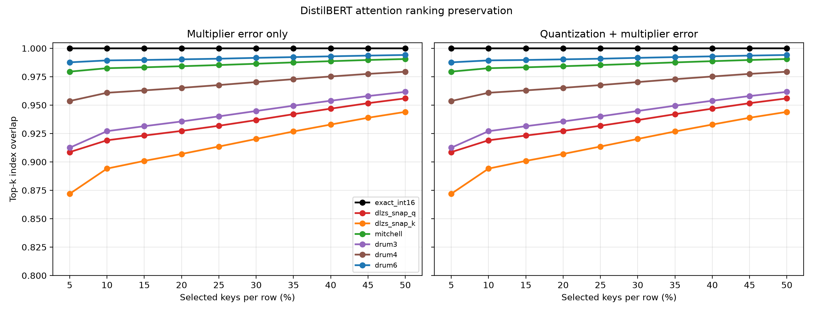](docs/images/results/topk_overlap.svg)

The existing plot is reproduced unchanged from this corpus run. Both panels
show means; the later passage-range correction does not change those curves.
The ordinate is truncated to 0.8–1.0. [Download all corrected values](docs/results/attention_corpus_20260914/summary_corrected.csv).

<details>
<summary>Full mean-overlap table versus the original floating-point scores</summary>

| Design | 5% | 10% | 15% | 20% | 25% | 30% | 35% | 40% | 45% | 50% |
| --- | --- | --- | --- | --- | --- | --- | --- | --- | --- | --- |
| `exact_int16` | 0.999963 | 0.999972 | 0.999968 | 0.999968 | 0.999970 | 0.999975 | 0.999975 | 0.999976 | 0.999978 | 0.999981 |
| `dlzs_snap_q` | 0.908631 | 0.919030 | 0.923208 | 0.927301 | 0.931808 | 0.936814 | 0.942030 | 0.946885 | 0.951700 | 0.955937 |
| `dlzs_snap_k` | 0.871937 | 0.894105 | 0.900890 | 0.906985 | 0.913525 | 0.920206 | 0.926791 | 0.932886 | 0.938856 | 0.944034 |
| `drum3` | 0.912500 | 0.927050 | 0.931436 | 0.935608 | 0.940110 | 0.944818 | 0.949493 | 0.953853 | 0.957988 | 0.961654 |
| `drum4` | 0.953612 | 0.960864 | 0.962960 | 0.965214 | 0.967645 | 0.970286 | 0.972837 | 0.975212 | 0.977490 | 0.979406 |
| `drum6` | 0.987661 | 0.989359 | 0.989748 | 0.990289 | 0.990857 | 0.991609 | 0.992279 | 0.992945 | 0.993596 | 0.994156 |
| `mitchell` | 0.979486 | 0.982496 | 0.983273 | 0.984246 | 0.985281 | 0.986413 | 0.987604 | 0.988694 | 0.989721 | 0.990596 |

</details>

### Passage variation and score error at 10% selection

| Design | Mean overlap | Passage min | Passage max | Passage SD | Mean layer score MAE |
| --- | --- | --- | --- | --- | --- |
| `exact_int16` | 1.000000 | 1.000000 | 1.000000 | 0.000000 | 0.000000 |
| `dlzs_snap_q` | 0.919028 | 0.914382 | 0.921729 | 0.001403 | 0.286569 |
| `dlzs_snap_k` | 0.894105 | 0.889184 | 0.899758 | 0.001954 | 0.281458 |
| `drum3` | 0.927053 | 0.924436 | 0.930004 | 0.001372 | 0.231260 |
| `drum4` | 0.960865 | 0.958623 | 0.962888 | 0.000892 | 0.106879 |
| `drum6` | 0.989360 | 0.988400 | 0.990446 | 0.000456 | 0.026031 |
| `mitchell` | 0.982496 | 0.980961 | 0.983866 | 0.000550 | 0.096117 |

Passage statistics come from means over each passage's six layers and twelve
heads. SD is the population standard deviation across these 100 passages,
not a confidence interval. Score MAE is the equal-layer mean of absolute,
dequantized score error against exact-int16 scores; it uses valid query/key pairs.

**Correction to the earlier console summary:** the reported minima of 0.3000
for DLZS were worst individual query-row overlaps, mislabeled as passage
minima. The corrected minima are **0.914382 for snapping Q** and **0.889184
for snapping K**. Means are unchanged. Use `summary_corrected.csv` or the
audit's `design_summary.csv` for passage ranges. The retained evaluator still
writes the old minimum field; this is a known reporting issue, not an arithmetic
change. The original `summary.csv` is included for provenance.

<details>
<summary>Five hardest passages for each design at 10% selection</summary>

| Design | Rank | Sample (zero-based) | Overlap | Valid tokens | Truncated |
| --- | --- | --- | --- | --- | --- |
| dlzs_snap_k | 1 | 90 | 0.889184 | 89 | False |
| dlzs_snap_k | 2 | 79 | 0.889247 | 97 | False |
| dlzs_snap_k | 3 | 94 | 0.890389 | 100 | False |
| dlzs_snap_k | 4 | 93 | 0.890416 | 105 | False |
| dlzs_snap_k | 5 | 52 | 0.890711 | 93 | False |
| dlzs_snap_q | 1 | 93 | 0.914382 | 105 | False |
| dlzs_snap_q | 2 | 94 | 0.915569 | 100 | False |
| dlzs_snap_q | 3 | 78 | 0.916605 | 102 | False |
| dlzs_snap_q | 4 | 29 | 0.916652 | 96 | False |
| dlzs_snap_q | 5 | 64 | 0.916768 | 96 | False |
| drum3 | 1 | 29 | 0.924436 | 96 | False |
| drum3 | 2 | 90 | 0.924452 | 89 | False |
| drum3 | 3 | 94 | 0.924639 | 100 | False |
| drum3 | 4 | 93 | 0.924747 | 105 | False |
| drum3 | 5 | 2 | 0.924926 | 88 | False |
| drum4 | 1 | 29 | 0.958623 | 96 | False |
| drum4 | 2 | 93 | 0.958802 | 105 | False |
| drum4 | 3 | 90 | 0.958992 | 89 | False |
| drum4 | 4 | 94 | 0.959014 | 100 | False |
| drum4 | 5 | 2 | 0.959017 | 88 | False |
| drum6 | 1 | 90 | 0.988400 | 89 | False |
| drum6 | 2 | 42 | 0.988527 | 96 | False |
| drum6 | 3 | 75 | 0.988534 | 86 | False |
| drum6 | 4 | 70 | 0.988547 | 83 | False |
| drum6 | 5 | 92 | 0.988571 | 96 | False |
| exact_int16 | 1 | 0 | 1.000000 | 81 | False |
| exact_int16 | 2 | 1 | 1.000000 | 85 | False |
| exact_int16 | 3 | 2 | 1.000000 | 88 | False |
| exact_int16 | 4 | 3 | 1.000000 | 97 | False |
| exact_int16 | 5 | 4 | 1.000000 | 92 | False |
| mitchell | 1 | 29 | 0.980961 | 96 | False |
| mitchell | 2 | 79 | 0.981286 | 97 | False |
| mitchell | 3 | 94 | 0.981306 | 100 | False |
| mitchell | 4 | 90 | 0.981308 | 89 | False |
| mitchell | 5 | 98 | 0.981314 | 97 | False |

The exact baseline is 1.0 everywhere, so its first five entries are ties.
Full texts are in [outlier_report.json](docs/results/attention_corpus_20260914/outlier_report.json).

</details>

### Layer-by-layer results at 10% selection

| Design | Layer 1 | Layer 2 | Layer 3 | Layer 4 | Layer 5 | Layer 6 |
| --- | --- | --- | --- | --- | --- | --- |
| exact_int16 | 1.0000 | 1.0000 | 1.0000 | 1.0000 | 1.0000 | 1.0000 |
| dlzs_snap_q | 0.8979 | 0.9141 | 0.9186 | 0.9269 | 0.9116 | 0.9451 |
| dlzs_snap_k | 0.8787 | 0.8928 | 0.8875 | 0.8998 | 0.8765 | 0.9295 |
| drum3 | 0.9138 | 0.9251 | 0.9239 | 0.9328 | 0.9165 | 0.9503 |
| drum4 | 0.9536 | 0.9598 | 0.9597 | 0.9639 | 0.9546 | 0.9736 |
| drum6 | 0.9871 | 0.9890 | 0.9891 | 0.9902 | 0.9876 | 0.9931 |
| mitchell | 0.9792 | 0.9823 | 0.9817 | 0.9836 | 0.9794 | 0.9888 |

[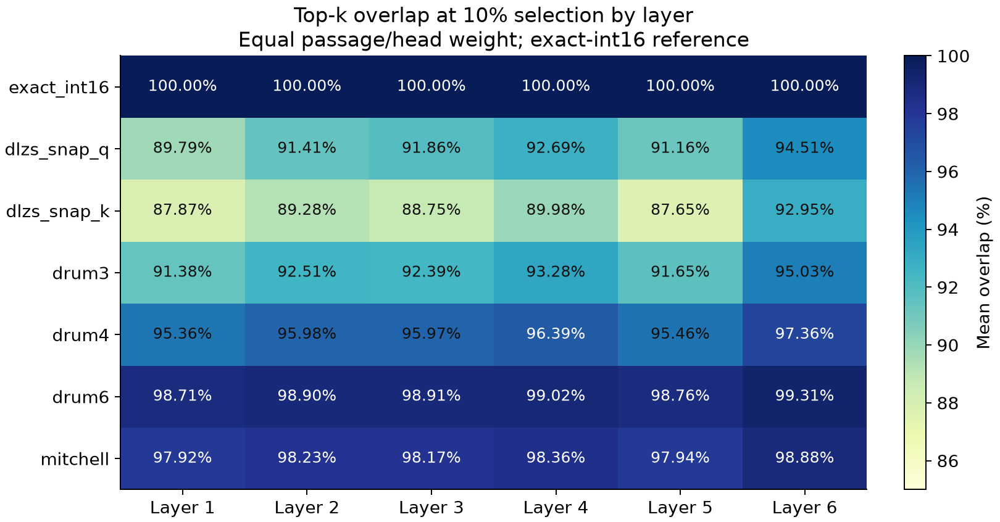](docs/images/results/attention_layers.svg)

[All layer/fraction/baseline values](docs/results/attention_corpus_20260914/per_layer.csv).

### Ranking preservation versus FPGA cost

| Attention design | Hardware | Overlap @10% | Slice LUTs | LUT cells | FFs | DSPs | Fmax (MHz) | WNS (ns) |
| --- | --- | --- | --- | --- | --- | --- | --- | --- |
| `exact_int16` | `exact_lut` | 100.00% | 265 | 357 | 64 | 0 | 104.29 | 0.411 |
| `dlzs_snap_q` | `dlzs_opt` | 91.90% | 145 | 169 | 64 | 0 | 121.51 | 1.77 |
| `dlzs_snap_k` | `dlzs_opt` | 89.41% | 145 | 169 | 64 | 0 | 121.51 | 1.77 |
| `drum3` | `drum_opt3` | 92.71% | 233 | 236 | 64 | 0 | 86.94 | -1.502 |
| `drum4` | `drum_opt4` | 96.09% | 273 | 278 | 64 | 0 | 76.62 | -3.051 |
| `drum6` | `drum_opt6` | 98.94% | 318 | 327 | 64 | 0 | 72.13 | -3.864 |
| `mitchell` | `mitchell` | 98.25% | 464 | 496 | 66 | 0 | 63.71 | -5.696 |

**Slice LUTs are physical utilization; LUT cells are the pre-packing count
reported by `summary.txt`.** The saved `attention_cost_table.csv` uses LUT
cells in its `impl_luts` column. Physical counts above come from each design's
`post_route/utilization.txt` and match §7; they must not be interchanged.

[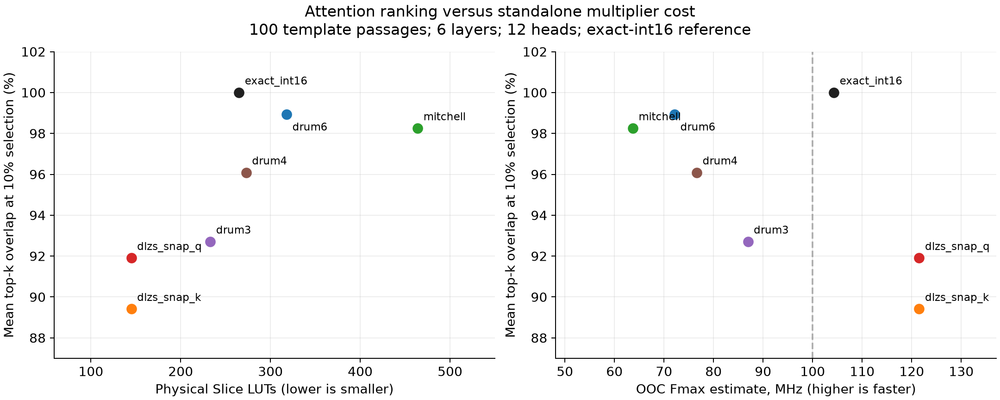](docs/images/results/attention_hardware_cost.svg)

This joins GPU ranking results with **standalone multiplier** OOC costs.
It excludes the AXI wrapper, score accumulators, memories, selectors, and
software overhead. It is not an area or speed estimate for a complete attention
accelerator. [Saved cost join](docs/results/attention_corpus_20260914/attention_cost_table.csv).

On this corpus, snapping Q preserves about **2.49 percentage points** more
top-k indices than snapping K at the same multiplier cost. DLZS-opt reduces
physical LUTs by **45.3%** and has **16.5%** higher reported OOC Fmax than exact
LUT, at the cost of about **8.10%** missing top-k indices at 10% selection.
DRUM3 improves overlap by about **0.80 percentage points** over snapping Q,
but uses 233 rather than 145 Slice LUTs and has lower reported Fmax.
DRUM6 and Mitchell preserve more rankings but cost more physical LUTs and
miss the 100 MHz OOC constraint. A satisfactory overlap threshold has not yet
been established with a downstream task.

### Earlier diagnostic stages

| Stage | Result | Scope |
|---|---|---|
| Model/projection inspection | Q, K, V and output projections: 768 → 768 | Setup check |
| First-layer reconstruction | All checks passed, 12 heads | 2 debugging passages |
| Exact quantization baseline | Score MAE 3.79816448e−5; max error 3.16170749e−4; 0 clipped | Same 2 passages |
| Baseline top-k versus float | Mean 1.0 at every tested fraction except 35%: 0.999740 | Debugging only |
| Scalar multiplier comparison | All seven designs evaluated | Same 2 passages |
| Multilayer diagnostic | Six layers compared | 4 debugging passages |
| Corpus evaluation | Complete with audit and cost join | 100 template passages |

At **10% selection**, mean overlap versus quantized exact evolved as follows:

| Design | 2 passages, layer 1 | 4 passages, all layers | 100 passages, all layers |
| --- | --- | --- | --- |
| exact_int16 | 1.0000 | 1.0000 | 1.0000 |
| dlzs_snap_q | 0.9201 | 0.9190 | 0.9190 |
| dlzs_snap_k | 0.9123 | 0.8939 | 0.8941 |
| drum3 | 0.9427 | 0.9272 | 0.9271 |
| drum4 | 0.9653 | 0.9614 | 0.9609 |
| drum6 | 0.9887 | 0.9892 | 0.9894 |
| mitchell | 0.9826 | 0.9826 | 0.9825 |

These are different text sets, so the columns are checks of the workflow,
not evidence of a statistical convergence trend. Compact early-stage reports
are preserved under [docs/results/attention_debug](docs/results/attention_debug).
The superseded diagnostic runners and CUDA setup check were removed during
cleanup; the final corpus evaluator includes reconstruction and kernel checks.

### Limits and evidence provenance

The 100 texts share 20 topic templates and five condition templates. Their
narrow passage range does not demonstrate robustness on independent natural
language, longer sequences, other checkpoints, or other models. No approximate
errors propagate between layers, and V, softmax outputs, downstream model
predictions, and classification accuracy are not evaluated under replacement.
The GPU study uses dynamic scales and int64 sums; these are not yet implemented
as a hardware dot-product pipeline.

Curated CSV/JSON evidence is copied into [docs/results/attention_corpus_20260914](docs/results/attention_corpus_20260914) so GitHub links do
not depend on ignored `results/` directories. Raw tensor archives remain local.
[snapshot.json](docs/results/attention_corpus_20260914/snapshot.json) records SHA-256 hashes of the copied
files. Original manifests retain the paths and source hashes from execution;
cleanup and line-ending normalization can change today's source hashes.
The range repair and newer key tiling are disclosed rather than presented as
a byte-identical rerun of all earlier scripts.

---

## 10. RTL

    rtl/lzc_8.sv            8-bit leading-one detector
    rtl/lzc_16.sv           16-bit, two cascaded lzc_8 blocks
    rtl/dlzc_mult.sv        unsigned 16x16 -> 32 DLZS core (original)
    rtl/dlzc_mult_top.sv    sign-magnitude shell around it (original)
    rtl/dlzs_snap_exp.sv    |A| -> snapped exponent e, via the merged-round V vector
    rtl/dlzs_b_prep.sv      B branch: sign-extend, conditional negate, zero guard
    rtl/dlzc_shift.sv       two-level barrel shifter, e[3:2] then e[1:0]
    rtl/dlzc_opt_top.sv     optimized signed DLZS top

    baselines/drum_opt/drum_opt_operand.sv   |X| -> sign-carrying operand + shift
    baselines/drum_opt/drum_opt_shift.sv     final shift
    baselines/drum_opt/drum_opt_top.sv       optimized signed DRUM(K) top

Things that are easy to get wrong and were got right:

- **`output_power` is not a leading-zero count** despite the module name: it
  is ⌊log₂ x⌋, the shift amount the datapath consumes.
- **Magnitude nets are unsigned.** |−32768| = 32768 fits 16-bit storage but
  not the signed range; declaring those nets `signed` breaks the design.
- **Sign extension happens before negation.** The B branch extends B to 17
  bits and then negates; negating at 16 bits loses +32768.
- **The B branch reads raw input bits only.** Taking `a_zero` from inside the
  A branch would put the B branch behind A's critical path.
- **Overflow bounds are asserted, not argued.** |p| ≤ 2^30 for DLZS; for
  DRUM, which can overestimate, the largest result for every K (≈1.68·10⁹ at
  K = 3) is checked to fit the 32-bit signed port.

---

## 11. Repository layout

    rtl/                    DLZS design sources (original and optimized)
    baselines/
      drum/                 vendored DRUM cores (upstream licence) + our signed shell
      drum_opt/             our FPGA-optimized DRUM(K)
      exact/                exact multiplier
      mitchell/             Mitchell core + signed shell
    synth/
      synth_ooc.tcl         OOC LUT-only synthesis + place and route of every design
      power.tcl             activity-driven power from the routed checkpoints
      constraints/ooc_clock.xdc
      wrappers/             identical register harnesses, one per design family
    tb/
      dirs.mk  common.mk    shared cocotb plumbing
      lzc/ mult/ mitchell/ drum/ exact/ opt/ drum_opt/     one directory per bench
    src/golden_model.py     bit-exact reference models, no float in any datapath
    src/metrics.py          MRED, NMED, max RED, signed bias, error rate
    src/sweep.py            8-bit exhaustive + 16-bit sampled sweeps
    src/attention_quantize.py     shared symmetric int16 quantizer
    src/attention_corpus_eval.py  final all-layer fixed-corpus evaluator
    src/attention_corpus_100.json fixed 100-passage corpus
    src/make_attention_corpus.py  deterministic corpus generator
    src/audit_attention_run.py    passage ranges, outliers and error summaries
    src/combine_attention_costs.py join overlap with OOC multiplier reports
    axi_lite_wrapper/dlzs/         Vivado project, block design and wrapper
    axi_lite_wrapper/ip_repo/dlzs_axi_1_0/  packaged IP and its RTL
    pynq_overlay/                 paired final .bit and .hwh files
    board_files/                  local PYNQ-Z2 board definitions (ignored)
    docs/results/                 curated, versionable experiment tables
    docs/images/results/          overlap, layer and hardware-cost figures
    results/                      local run directories and tensor archives (ignored)
    tests/test_golden_model.py    19-test regression suite
    synth_result/<design>/  committed synthesis and post-route reports
    docs/progress.md
    docs/images/schematics/           Yosys RTL schematics
    docs/images/vivado/elaborated/    Vivado elaborated schematics
    scripts/export_yosys.sh           regenerate the Yosys diagrams
    scripts/export_vivado.tcl         export Vivado schematic PDFs

The golden model is the **authority**. RTL is verified against the model, not
against the exact product — an approximate multiplier that matched the exact
product would be a bug.

---

## 12. Running it

From the repo root:

    make test      # golden-model regression suite (19 tests)
    make sweep     # error sweeps -> results/
    make sim       # all seven cocotb benches
    make lint      # Verilator lint on all seven
    make smoke     # fast test + sim, for the pre-commit loop
    make synth     # Vivado OOC synth + place and route -> synth_result/
    make designs   # list the buildable designs
    make synth-one DESIGN=dlzs_opt
    make power     # activity-driven power from the routed checkpoints

| Bench | Tests | Random-count variable |
|---|---|---|
| `tb/lzc` | 3 | `LZC_N_RANDOM` |
| `tb/mult` | 5 | `MULT_N_RANDOM` |
| `tb/mitchell` | 5 | `MITCHELL_N_RANDOM` |
| `tb/drum` | 7 | `DRUM_N_RANDOM` |
| `tb/exact` | 8 | `EXACT_N_RANDOM` |
| `tb/opt` | 8 | `OPT_N_RANDOM` |
| `tb/drum_opt` | 5 | `DRUM_OPT_N_RANDOM` |

Synthesis options go after `-tclargs`:

    vivado -mode batch -source synth/synth_ooc.tcl -tclargs dlzs_opt exact_lut -force
    vivado -mode batch -source synth/synth_ooc.tcl -tclargs -period 8 -force

Every run writes to `synth_result/<design>/`, so copy that folder aside before
a run at a different period.

**Vivado under WSL.** If `vivado` is a shell alias to the Windows
`vivado.bat`, `make` cannot see it. Export the same command so the Makefile
picks it up:

    export VIVADO='cmd.exe /c "C:\AMDDesignTools\2025.2\Vivado\bin\vivado.bat"'

The `Route 35-198` warning about `HD.PARTPIN_LOCS` is expected in OOC runs and
does not affect any reported number: every port lands on a harness register,
and port paths are unconstrained.

### Final attention workflow (WSL, activated Python environment)

Run from the repository root. The saved corpus is the default study input;
regenerate it only when needed with `python src/make_attention_corpus.py`.

```bash
python src/attention_corpus_eval.py \
  --texts src/attention_corpus_100.json \
  --revision 12040accade4e8a0f71eabdb258fecc2e7e948be \
  --device cuda --max-length 128 --batch-size 8 \
  --query-block 16 --key-block 16
```

The 16×16 query/key tiles are the successful settings for the 8 GiB RTX 4070
Laptop GPU. The earlier broad product allocation exhausted memory. Use
`--device cpu` when CUDA is unavailable; the arithmetic reference is unchanged.
`--no-save-tensors` reduces output storage if raw Q/K archives are unnecessary.

To audit the retained completed run and regenerate its hardware join:

```bash
run=results/attention_corpus_eval/20260914T070644_541555Z
python src/audit_attention_run.py --input "$run" --percent 10
python src/combine_attention_costs.py --attention-run "$run" --synth-root synth_result
```

For a new run, set `run` to its printed output directory. The audit recomputes
correct passage ranges directly from `per_text.csv`. The cost join prefers
`summary_corrected.csv` when available; without it, the current evaluator's
minimum-field bug also affects the joined minimum column. Use audit output
for passage minima until that reporting bug is fixed.

Curated documentation snapshots are for reading the results; the audit expects
the original full run directory, including its per-head rows. The plot scripts
used during exploration were pruned; final PNG/SVG figures are retained here.

### Reopening the hardware project after cleanup

Open `axi_lite_wrapper/dlzs/dlzs.xpr` in Vivado 2025.2. Keep the local PYNQ-Z2
board definitions and the packaged IP repository available. The tracked HDL
wrapper under `dlzs.gen` is retained; other generated products may need to be
regenerated from the block design before a new build. The preserved overlay
pair is independent of those temporary directories. Reopening/rebuilding after
cleanup has not yet been recorded as a validation result.

Cleanup also removed routed `.dcp` files used by `make power`; regenerate the
needed checkpoints with `make synth` (or a targeted `make synth-one`) before
rerunning that command. Preserve existing reports before a new synthesis run.

### Reproducibility

The 8-bit sweep is exhaustive. The 16-bit sweep combines a fixed-seed uniform
sample (seed **20260828**) with an explicit corner set, and both are recorded
in the output header. DLZS is asymmetric, so input pairs are **ordered**:
(a, b) and (b, a) are different experiments and both appear. The benches
import their 16-bit stimulus from `sweep.sampled_pairs()`, so the verified
vectors and the published error tables are the same set.

---

## 13. Known issues

1. **`metrics.py` signed bias.** Dividing by `abs(p)` flips the sign on
   negative products, so signed `bias` averages to ≈ 0 regardless of the
   core. The comment there claims otherwise. Characterize bias on magnitudes,
   or divide by `p` for a magnitude-consistent sign.
2. **Mitchell worst-case note.** `golden_model.py` says the −11.1 % worst case
   is at mantissas near 0.44; it is at exactly 0.5.
3. **Fmax of passing designs is understated** (§7) — tighter-period run pending.
   **Power remains estimated** — refined reports are committed for DLZS, DRUM
   and exact; Mitchell's activity-driven run and SAIF-based validation remain
   pending.
4. **The RTL is fixed at 16 bits.** No 8-bit synthesis numbers and no
   exhaustive 8-bit model/RTL equivalence yet.
5. **No ≥10,000-vector PYNQ hardware log is committed yet.** The AXI wrapper has
   passed a local Vivado XSim smoke test; the real-board regression is pending
   until the PYNQ-Z2 is available.
6. **Attention summary minima:** the current evaluator labels query-row minima
   as passage minima. Saved corrected tables and the audit fix the interpretation;
   the producer still needs correction before a fresh publication run.
7. **Attention scope:** 100 correlated template passages and one checkpoint;
   no downstream task evaluation or propagated approximation. Compensation is pending.
8. **Post-cleanup reproduction:** routed checkpoints and diagnostic runners
   were removed; hardware products must be regenerated for new timing/power runs.
9. **Vendored DRUM lint warnings are waived, not fixed** (`WIDTHEXPAND`,
   `UNUSEDSIGNAL`), scoped to the benches that compile upstream code.

---

## 14. Roadmap

| Week | Scope | Status |
|------|-------|--------|
| 1–2 | Literature lock + golden model | done |
| 3–5 | DLZS RTL + verification | done |
| 6–7 | Baselines, OOC LUT-only synthesis, comparison table | mostly done — DLZS, DRUM K=3..8, Mitchell and exact LUT/DSP reports included; remaining: 8-bit characterization, committed simulation evidence, Mitchell refined power, tighter-period run |
| 8–9 | AXI-Lite wrapper, PYNQ-Z2 overlay, ≥10,000 vectors hardware-vs-sim | in progress — wrapper, validated block design, timing, bitstream, and local smoke test complete; board regression pending |
| 10–11 | Attention Q/K from DistilBERT, top-k index overlap vs hardware cost | fixed-corpus study complete: 100 passages, 6 layers, both snap directions, audited tables, plots and OOC cost join; generalization/task validation remains open |
| 12–13 | MBM-style error compensation, accuracy-vs-LUTs Pareto front | planned; no compensation results yet |
| 14 | Buffer, thesis writeup, defense dry-run | README and evidence updated; thesis and defense preparation pending |

Scope is cut from the **top tier down** if the schedule slips — compensation
first, then the application study — never the baseline characterization.

**Designed-in test hook for Week 12.** The compensation LUT must reduce to
uncompensated DLZS when it is all zeros. That degenerate-parameter test is the
same shape as `test_drum_degenerates_to_exact_at_k_equals_w`, the strongest
test in the suite, and it should exist from the compensation module's first
commit.

---

## 15. Environment

- **Board:** PYNQ-Z2 (primary); Arty A7-100T (optional stretch)
- **Tools:** Vivado 2025.2, Icarus Verilog / Verilator, cocotb, Python 3, PyTorch
- **Recorded GPU run:** PyTorch `2.11.0+cu128`, CUDA runtime `12.8`,
  Transformers `5.17.0`, NumPy `2.5.3`, RTX 4070 Laptop GPU (8 GiB).
  These are the completed run's manifest values; earlier CPU setup checks used
  a different Torch build. They describe the experiment, not a dependency lockfile.
- **Synthesis constraints:** out-of-context, `USE_DSP="no"`,
  matched bit-widths, identical input distributions across all designs. The
  exact multiplier is reported twice — LUT-only, and DSP-mapped as a separate
  reference row.

---

## 16. References

1. J. N. Mitchell, "Computer Multiplication and Division Using Binary
   Logarithms," *IRE Transactions on Electronic Computers*, 1962.
2. S. Hashemi, R. I. Bahar, S. Reda, "DRUM: A Dynamic Range Unbiased
   Multiplier for Approximate Applications," *ICCAD*, 2015.
3. Wang et al., "SOFA: A Compute-Memory Optimized Sparsity Accelerator via
   Cross-Stage Coordinated Tiling," *MICRO*, 2024. — origin of the DLZS scheme.
4. MBM (Mitchell-based multiplier with error compensation) — the model for the
   Week 12–13 compensation tier.

Related work also includes power-of-two weight quantization, against which this
scheme must be positioned rather than compared favourably by default.

